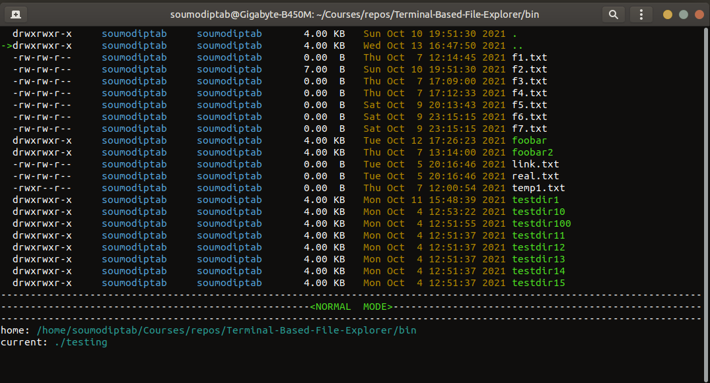
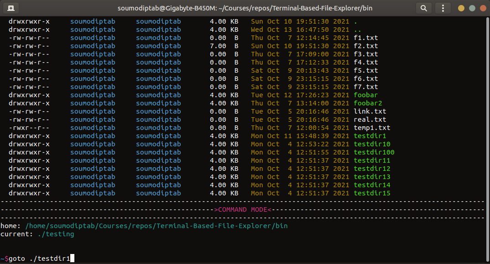
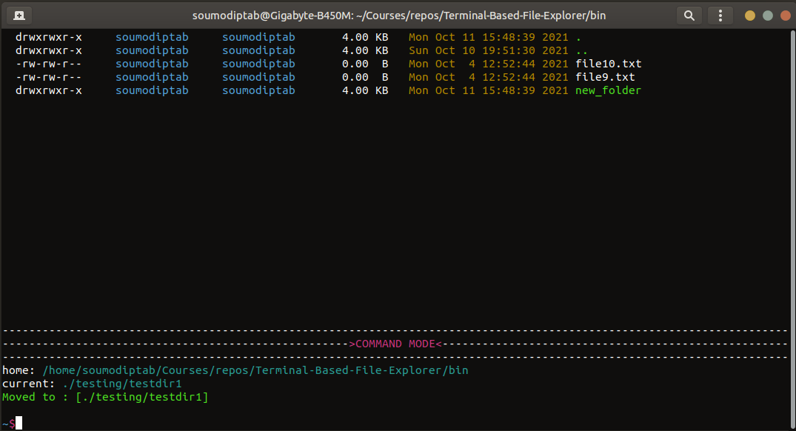

# Terminal-Based-File-Explorer
This Repository contains the Terminal Based File Explorer built as part of Advanced Operating Systems Coursework.
## BRIEF:
This Repository is the implementation of File-Explorer in Terminal as part of Advanced Operating Systems Coursework using the proper invocations of various system call and not relying on ncurses for GUI.
## ASSUMPTIONS:
As per the ASSIGNMENT PDF:
* The root of your application should be the directory where the application was started.
* Home - h key should take the user to the home folder (the folder where the application was started).
## Makefile users:
Binaries are present in `/bin`
* `make`: Builds the binaries
* `make clean` : Remove the object files
* `make run` : Build and run the application
## For Debugging:
`Makefile` is already configured to use debugging just use the attached `.vscode` configuration.
### Libraries Used:
* termios.h
* sys/ioctl.h
* sys/stat.h
* dirent.h
* grp.h
* pwd.h
* fcntl.h
* bits/stdc++.h
<hr>

## NORMAL MODE :

Navigation Keys:

* ` ↑ `: Moves the cursor arrow upwards.
* ` ↓ `: Moves the cursor arrow downwards.
* ` ← `: Goes back to previously visited directory.
* ` → `: Goes to next directory.
* `h`: Goes to `Home` which is currently set.(where application starts from)
* `Backspace` : Goes to parent directory.
* ` k `: Scroll Window Up
* ` l `: Scroll Window down
* ` q `: Quit the Explorer
<hr>

## COMMAND MODE:


##### PATHS:
* `.` : current directory
* `~` : home directory

All the paths will be in reference to one of theses two.
### Command List:
#### `copy ` : Copies the files and folders from current directory to destination directory.
```
copy <source_file(s)/folder(s)> <destination_directory>
```
#### `move ` : Moves the files and folders from current directory to destination directory.
```
copy <source_file(s)/folder(s)> <destination_directory>
```
#### `rename` : Renames the file.
```
rename <old_filename> <new_filename>
```
#### `create_file` : Can create 1 or more files in the destination path specified.
```
create_file <file_name(s)> <destination_path>
```
#### `create_dir` : Can create 1 or more directories in the destination path specified.
```
create_file <directory_name(s)> <destination_path>
```
#### `delete_file` : Can delete a file from the specified path.
```
delete_file <file_path>
```
#### `delete_dir` : Can delete a directory and all its contents from the specified path.
```
delete_dir <dir_path>
```
#### `goto` : Traverses to the directory.
```
goto <directory_path>
```
#### `search` : Searches for a file/folder recursively starting from the current directory.
```
search <filename/foldername>
```
#### `ESC` : Pressing `ESC` key will go to normal mode.
#### `q` : Pressing `q` and `Enter` from command mode will exit the application.
#### Live Update in COMMAND MODE:

All the commands are built in a way that their actions are reflected in a live way in the directory listing of the normal mode , to provide users a sense that their commands are actually working.

#### ADDITIONAL IMPLEMENTATIONS:
* The cursor is hidden in normal mode and an arrow is printed to point the directory entry.
* Auto resize: Window resize automatically resizes everything in the explorer as well as maintains the command buffer in command mode.
* It has alternate linux mode configuration that can be switched on that changes the paths to use normal linux paths. Just change the boolean flag to true.
